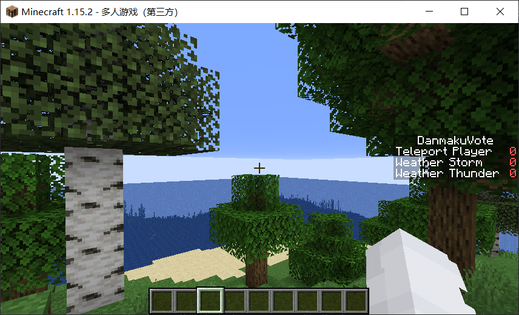

# DanmakuVote

这是一个实现Bilibili直播间与Minecraft服务器互动的插件

可以设置随机或固定的时间进行观众投票，接收指定直播间的弹幕进行统计，最后实现部分事件的触发

后续或许可以考虑一下国外直播平台版本？（如果有需求的话

## 插件指令

`setid [直播间room_id号]`:设置监听的直播间房间号

`setworld`: 设置当前所在世界为事件发生世界，对应配置文件中的world项

`voteswitch`: 设置插件状态，进行开和关

`time [random|static] [mintime maxtime | statictime]`:设置随机投票时间区间或固定间隔时间

## 目前存在问题

* 部分事件会出现不生效的情况，如投票设置天气为晴天后无法设置为阴天

* 部分代码可能会出现空指针的问题，具体是否为出现报错待测试

* 没有进行倒计时显示，同时游戏内的插件时间不是很准确，存在延时问题

## 已实现的事件

`WORLD_CHANGE`：世界天气修改

`PLAYER_TELEPORT`：玩家传送到随机位置

`PLAYER_GENERATE_MOBS`：在玩家位置生成一个怪物

`PLAYER_PUT_ANIMAL`：在玩家位置生成一个动物

## 相关信息

本插件的idea来自于Ubisoft的Hyper Space，游戏可以在Twitch平台进行投票影响游戏进程

同时在这个时候看到有Bilibili的弹幕监听轮子，然后就构思实现了这个插件

相关的开发信息可见[Decision`s blog](https://decision01.cn/)

PS:很多时候博客更的比DevelopLog.md慢